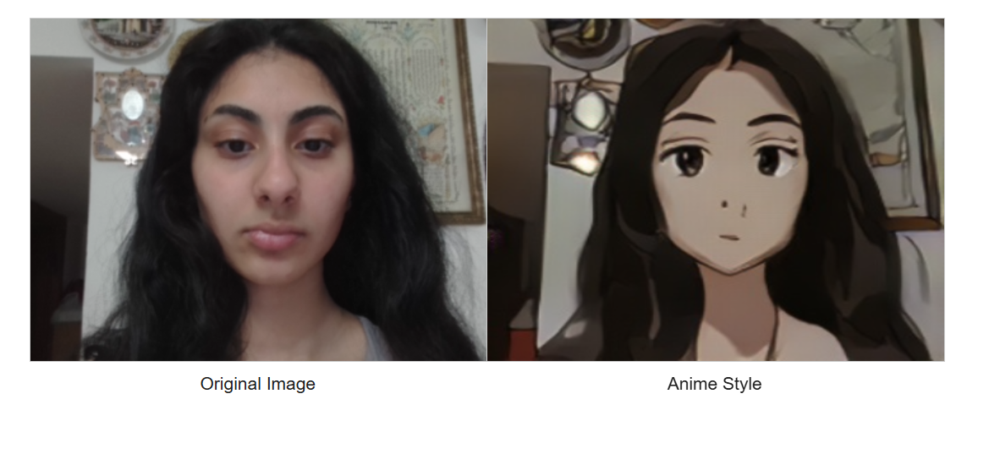
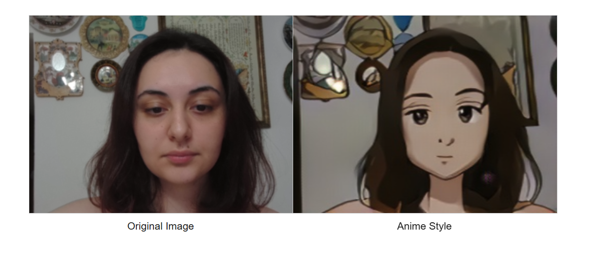

# Anime Style Transfer

This project transforms real human face images into anime-style portraits using CycleGAN.

Built and trained in Google Colab with a custom dataset.  
Includes real-time webcam inference and style preservation using PyTorch and OpenCV.

---

## Example Results

| Original + Anime Style |
|------------------------|
|  |
|  |

The above images were generated using real-time webcam inference.

---

## Features

- CycleGAN-based face-to-anime transformation  
- Trained on custom dataset (real faces ↔ anime portraits)  
- Real-time webcam inference with OpenCV  
- Implemented in PyTorch  

---

## Files

- `AnimeStyleTransfer.ipynb` – Full notebook with training and inference  
- `animestyletransfer.py` – Script version of the notebook  

---

## Installation

No installation needed if using Colab.

To run locally:
```bash
pip install torch torchvision opencv-python matplotlib
